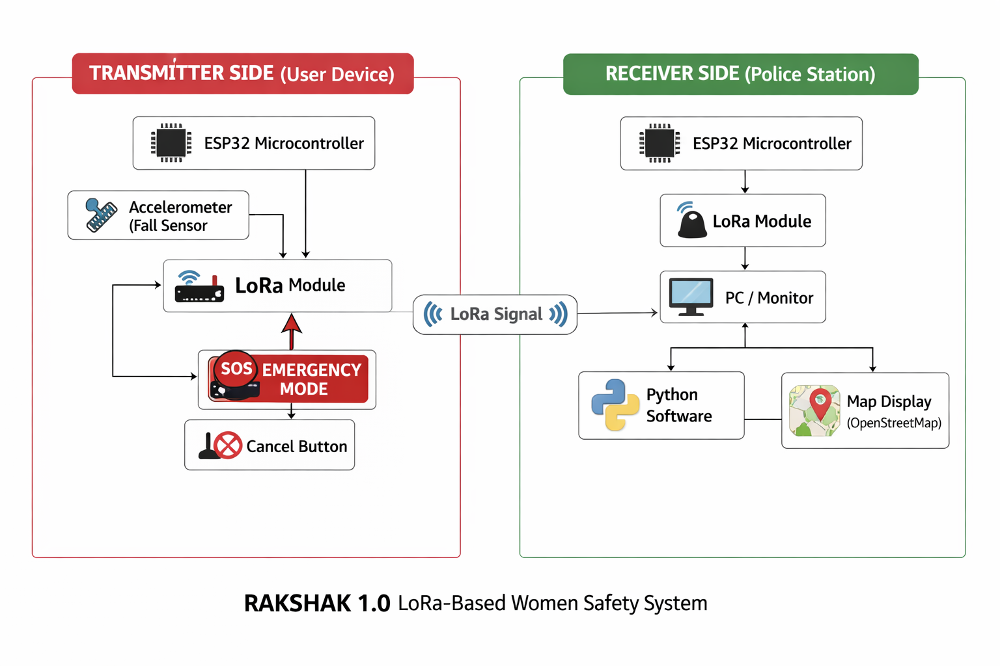
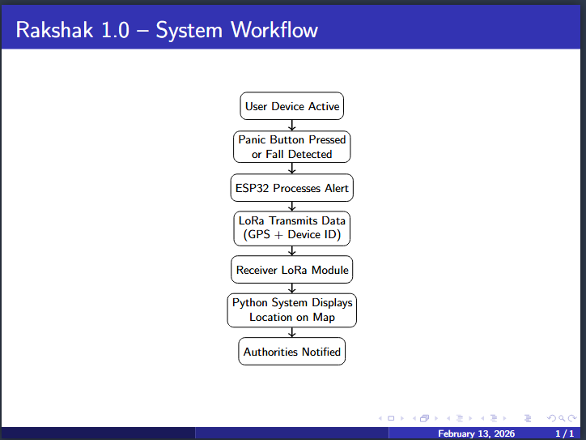
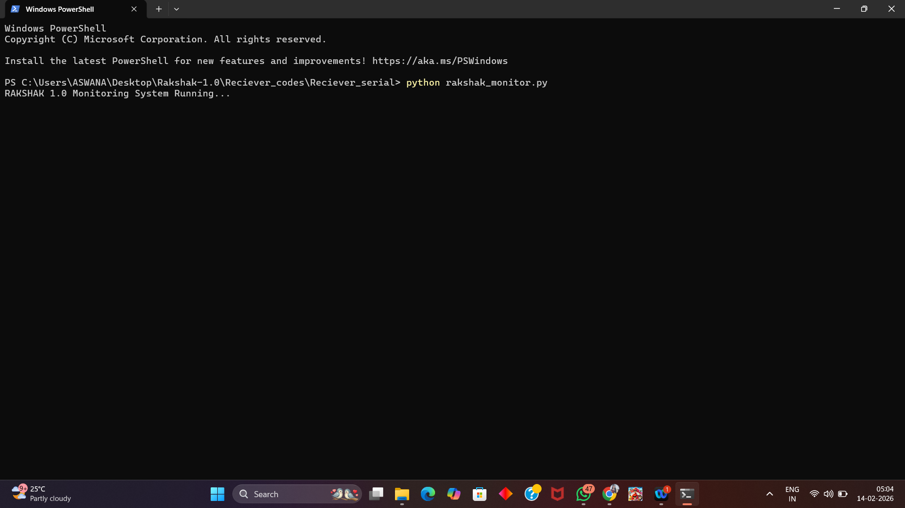
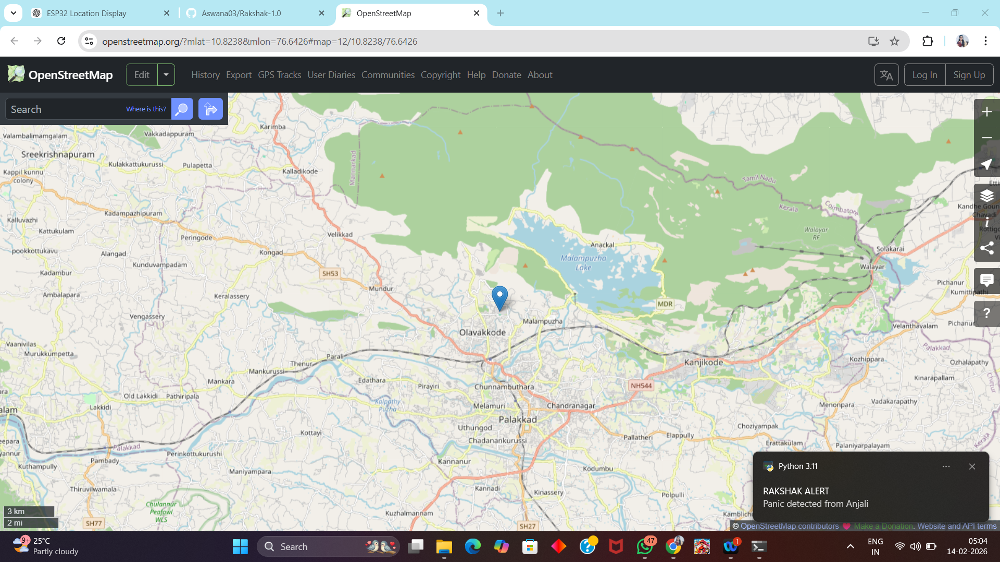
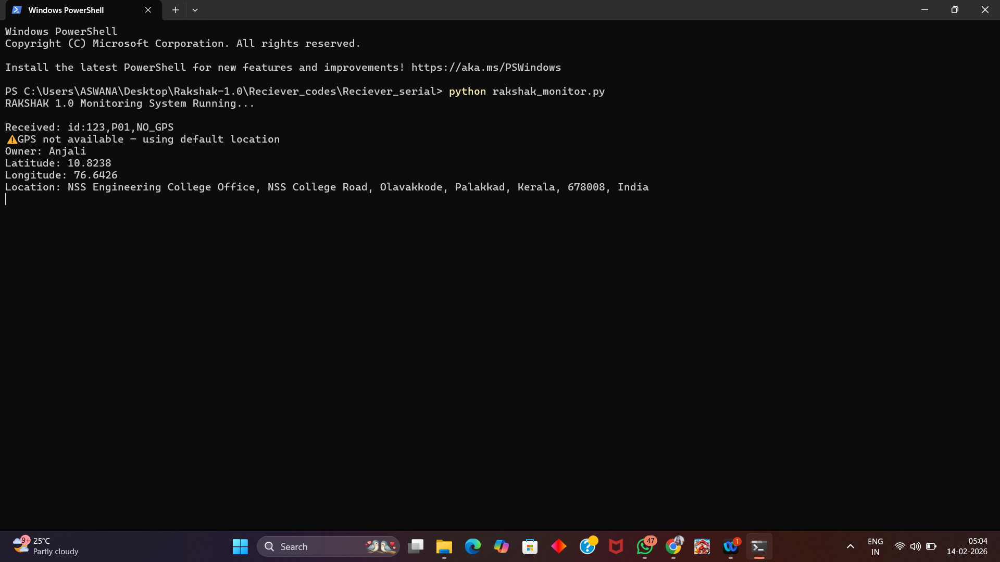
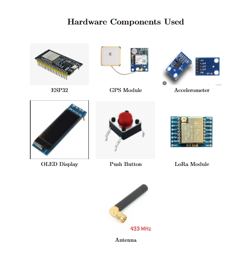
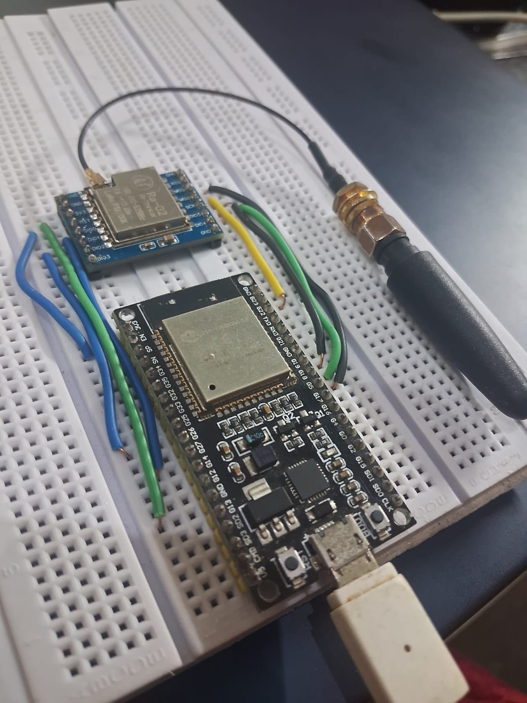
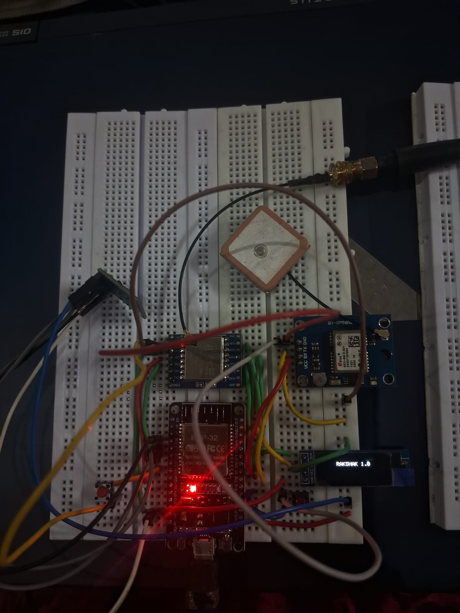
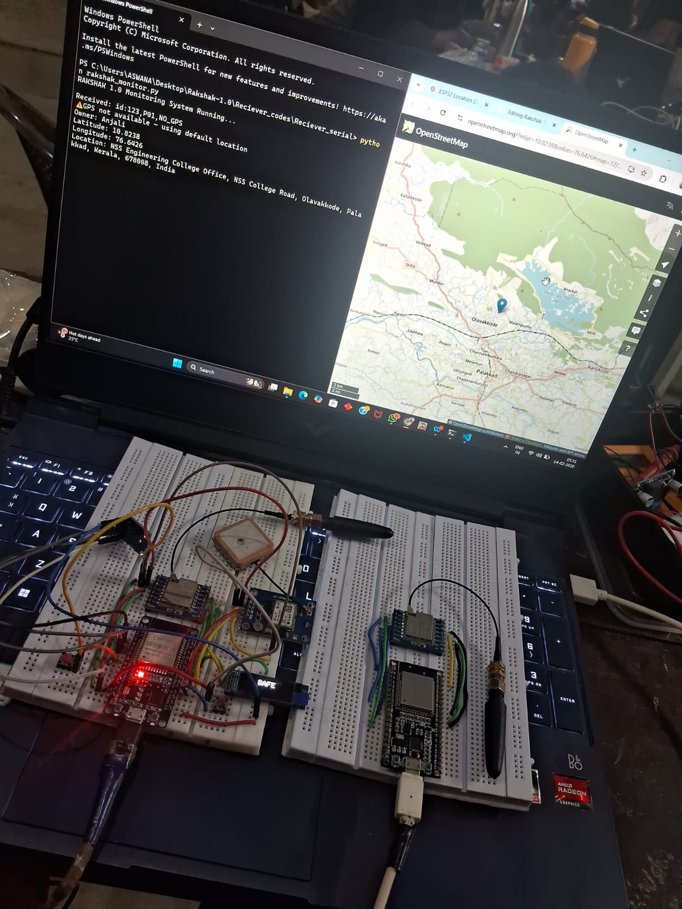

<p align="center">
  
</p>

# RAKSHAK-1.0🎯

## Basic Details

### Team Name: META MAKERS

### Team Members
- Member 1: Aswana N - NSS COLLEGE OF ENGINEERING , PALAKKAD

### Hosted Project Link
[mention your project hosted link here]

### Project Description
Rakshak 1.0 is a LoRa-based women safety system designed for rural areas that works without internet connectivity. It instantly transmits emergency alerts with live GPS location through panic activation or automatic fall detection to nearby police stations for rapid response.

### The Problem statement
Women in rural areas lack reliable emergency communication due to poor internet connectivity, making existing safety solutions ineffective during critical situations.

### The Solution
We solve this problem by developing Rakshak 1.0, a wearable, offline women safety system that uses long-range LoRa communication instead of internet-based networks. The device integrates an ESP32 microcontroller, GPS module, accelerometer, panic button, and cancel mechanism to detect emergencies either manually or automatically through fall detection. Upon activation, it transmits real-time latitude, longitude, device ID, and alert type directly to a LoRa receiver installed at a police station within a 5–10 km range. The receiver system processes the data using a Python-based interface and displays the exact location on a digital map, enabling authorities to respond quickly even in network-deficient rural environments.


## Technical Details

### Technologies/Components Used

**For Software:**
- Languages used: Python
- Frameworks used: None
- Libraries used: Pyserial,Requests,Plyer
- Tools used: Python,Notepad,Web browser

**For Hardware:**
- Main components: ESP 32,NEO 6M GPS Module,RA-02 LoRa Module,OLED Display,ADXL335 Accelerometer
- Tools required: USB Cable,Breadboard,Jumper wires/Single strand wires,PC etc....

---

## Features

List the key features of your project:
- Feature 1: Internet-Independent Long-Range Communication.
- Feature 2: Real-Time Panic and Fall Detection.
- Feature 3: Unique Device ID-Based User Identification.
- Feature 4: Offline Monitoring and Alert System.


## Implementation

### For Software:

#### Installation
```bash
[Installation commands - pip install pyserial plyer requests]
```

#### Run
```bash
[Run commands - python rakshak_monitor.py]
```

### For Hardware:

#### Components Required
1. ESP32 Microcontroller  
2. LoRa Module (433 MHz)  
3. GPS Module (NEO-6M)  
4. Accelerometer  
5. OLED Display  
6. Push Buttons  
7. LoRa Antenna  
8. Connecting Wires  

#### Circuit Setup
The transmitter circuit is built around the ESP32 microcontroller, where the LoRa module is connected via SPI communication pins, the GPS module through UART, and the accelerometer and OLED display through I2C interface. Panic and cancel buttons are connected to digital GPIO pins with pull-up configuration for emergency triggering. The receiver side uses another ESP32 interfaced with a LoRa module via SPI and connected to a computer through USB for data visualization.



---

## Project Documentation

### For Software:

#### Screenshots (Add at least 3)


Shows the Rakshak 1.0 Python-based monitoring application running in Windows PowerShell, continuously listening to the ESP32 receiver for incoming LoRa emergency data in real time.


Displays the automatically opened OpenStreetMap view pinpointing the user’s emergency location using received latitude and longitude coordinates for quick visual identification.


Shows the processed emergency message including device ID, user name, fallback GPS handling, precise coordinates, human-readable location, and confirmation of panic alert detection.

#### Diagrams

**System Architecture:**


**Application Workflow:**


*Add caption explaining your workflow*

---

### For Hardware:

#### Schematic & Circuit


*Add caption explaining connections*


*Add caption explaining the schematic*

#### Build Photos





Displays the receiver-side ESP32 connected to the RA-02 LoRa module and antenna, responsible for capturing transmitted emergency packets and forwarding clean serial data to the Python-based monitoring system.


Shows the complete transmitter-side hardware setup on a breadboard, integrating the ESP32 microcontroller with the NEO-6M GPS module, RA-02 LoRa transceiver with external antenna, OLED display for status output, and interconnecting jumper wires for real-time emergency data transmission.


Shows the complete Rakshak 1.0 women safety system operating in real time, with the transmitter unit capturing GPS data and emergency events, the receiver unit receiving LoRa alerts, and the Python monitoring application simultaneously displaying processed emergency data and live location on OpenStreetMap along with instant desktop notifications.

---

## Additional Documentation

### For Web Projects with Backend:

#### API Documentation

**Base URL:** `https://api.yourproject.com`

##### Endpoints

**GET /api/endpoint**
- **Description:** [What it does]
- **Parameters:**
  - `param1` (string): [Description]
  - `param2` (integer): [Description]
- **Response:**
```json
{
  "status": "success",
  "data": {}
}
```

**POST /api/endpoint**
- **Description:** [What it does]
- **Request Body:**
```json
{
  "field1": "value1",
  "field2": "value2"
}
```
- **Response:**
```json
{
  "status": "success",
  "message": "Operation completed"
}
```

[Add more endpoints as needed...]

---

### For Mobile Apps:

#### App Flow Diagram


*Explain the user flow through your application*

#### Installation Guide

**For Android (APK):**
1. Download the APK from [Release Link]
2. Enable "Install from Unknown Sources" in your device settings:
   - Go to Settings > Security
   - Enable "Unknown Sources"
3. Open the downloaded APK file
4. Follow the installation prompts
5. Open the app and enjoy!

**For iOS (IPA) - TestFlight:**
1. Download TestFlight from the App Store
2. Open this TestFlight link: [Your TestFlight Link]
3. Click "Install" or "Accept"
4. Wait for the app to install
5. Open the app from your home screen

**Building from Source:**
```bash
# For Android
flutter build apk
# or
./gradlew assembleDebug

# For iOS
flutter build ios
# or
xcodebuild -workspace App.xcworkspace -scheme App -configuration Debug
```

---

### For Hardware Projects:

#### Bill of Materials (BOM)

| Component               | Quantity | Specifications                       | Price (Approx) | Link/Source |
| ----------------------- | -------- | ------------------------------------ | -------------- | ----------- |
| ESP32 Development Board | 2        | Dual-core 32-bit MCU, WiFi/Bluetooth | ₹600 each      | [Link]      |
| RA-02 LoRa Module       | 2        | 433 MHz long-range transceiver       | ₹450 each      | [Link]      |
| NEO-6M GPS Module       | 1        | UART GPS receiver with antenna       | ₹750           | [Link]      |
| OLED Display            | 1        | 0.96”, 128×64, I2C                   | ₹250           | [Link]      |
| ADXL335 Accelerometer   | 1        | 3-axis analog sensor                 | ₹300           | [Link]      |
| Breadboard              | 2        | 830 tie-points                       | ₹120 each      | [Link]      |
| Jumper Wires/Single strand wires          | 1 set    | Male-to-male                         | ₹100           | [Link]      |
| External LoRa Antenna   | 2        | SMA connector                        | ₹150 each      | [Link]      |
| USB Cable               | 2        | Micro USB                            | ₹80 each       | [Link]      |


Total Estimated Cost: ₹3,800 – ₹4,200 (approx.)

#### Assembly Instructions

**Step 1: Prepare Components**
1. Gather all components listed in the BOM
2. Check component specifications
3. Prepare your workspace

*Caption: All components laid out*

**Step 2: Build the Power Supply**
1. Connect the power rails on the breadboard
2. Connect Arduino 5V to breadboard positive rail
3. Connect Arduino GND to breadboard negative rail

*Caption: Power connections completed*

**Step 3: Add Components**
1. Place LEDs on breadboard
2. Connect resistors in series with LEDs
3. Connect LED cathodes to GND
4. Connect LED anodes to Arduino digital pins (2-6)

*Caption: LED circuit assembled*

**Step 4: [Continue for all steps...]**

**Final Assembly:**

*Caption: Completed project ready for testing*

---

### For Scripts/CLI Tools:

#### Command Reference

**Basic Usage:**
```bash
python script.py [options] [arguments]
```

**Available Commands:**
- `command1 [args]` - Description of what command1 does
- `command2 [args]` - Description of what command2 does
- `command3 [args]` - Description of what command3 does

**Options:**
- `-h, --help` - Show help message and exit
- `-v, --verbose` - Enable verbose output
- `-o, --output FILE` - Specify output file path
- `-c, --config FILE` - Specify configuration file
- `--version` - Show version information

**Examples:**

```bash
# Example 1: Basic usage
python script.py input.txt

# Example 2: With verbose output
python script.py -v input.txt

# Example 3: Specify output file
python script.py -o output.txt input.txt

# Example 4: Using configuration
python script.py -c config.json --verbose input.txt
```

#### Demo Output

**Example 1: Basic Processing**

**Input:**
```
This is a sample input file
with multiple lines of text
for demonstration purposes
```

**Command:**
```bash
python script.py sample.txt
```

**Output:**
```
Processing: sample.txt
Lines processed: 3
Characters counted: 86
Status: Success
Output saved to: output.txt
```

**Example 2: Advanced Usage**

**Input:**
```json
{
  "name": "test",
  "value": 123
}
```

**Command:**
```bash
python script.py -v --format json data.json
```

**Output:**
```
[VERBOSE] Loading configuration...
[VERBOSE] Parsing JSON input...
[VERBOSE] Processing data...
{
  "status": "success",
  "processed": true,
  "result": {
    "name": "test",
    "value": 123,
    "timestamp": "2024-02-07T10:30:00"
  }
}
[VERBOSE] Operation completed in 0.23s
```

---

## Project Demo

### Video
[Add your demo video link here - YouTube, Google Drive, etc.]

*Explain what the video demonstrates - key features, user flow, technical highlights*

### Additional Demos
[Add any extra demo materials/links - Live site, APK download, online demo, etc.]

---

## AI Tools Used (Optional - For Transparency Bonus)

If you used AI tools during development, document them here for transparency:

**Tool Used:** ChatGPT

**Purpose:** [What you used it for]
1. Debugging ESP32 and Python serial communication issues
2. Improving code structure and error handling
3. Generating documentation content (README, technical descriptions, BOM formatting)
4. Assisting in reverse geocoding integration logic

**Key Prompts Used:**
1. “Fix serial decoding errors in Python for ESP32 communication”
2. “Modify LoRa receiver code to output clean serial data”
3. “Explain GPS fallback handling in monitoring software”
4. “Format Bill of Materials for hardware project README”

**Percentage of AI-generated code:** Approximately 35–40%

**Human Contributions:**
- Architecture design and planning
- Custom business logic implementation
- Integration and testing
- UI/UX design decisions

*Note: Proper documentation of AI usage demonstrates transparency and earns bonus points in evaluation!*

---

## Team Contributions

- [Name 1]: [Specific contributions - e.g., Frontend development, API integration, etc.]
- [Name 2]: [Specific contributions - e.g., Backend development, Database design, etc.]
- [Name 3]: [Specific contributions - e.g., UI/UX design, Testing, Documentation, etc.]

---

## License

This project is licensed under the [LICENSE_NAME] License - see the [LICENSE](LICENSE) file for details.

**Common License Options:**
- MIT License (Permissive, widely used)
- Apache 2.0 (Permissive with patent grant)
- GPL v3 (Copyleft, requires derivative works to be open source)

---

Made with ❤️ at TinkerHub
